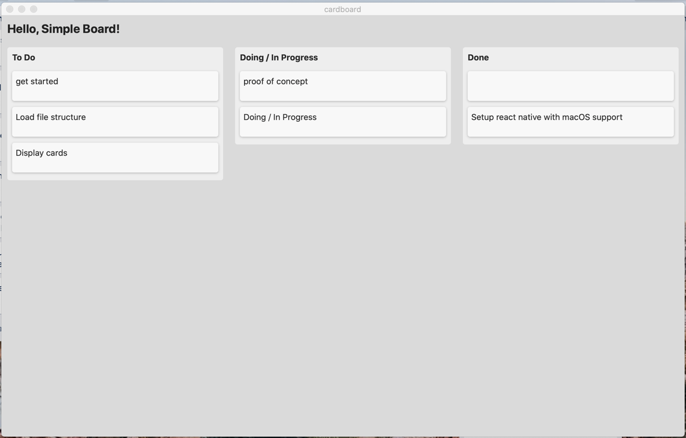

# Cardboard

File-based kanban board that lives next to your code.

## About

Cardboard makes you independent of GitHub, GitLab & Co. for tracking your personal project-specific work items. And wherever your code repository goes, so do your work items. As an added bonus it's a native desktop app that works offline.

## Development

This is a new project and still under heavy development.
It's based on the following great technologies:

 * [React Native](https://reactnative.dev/)
 * [React Native for Windows + macOS](https://microsoft.github.io/react-native-windows/)
 * [TypeScript](https://www.typescriptlang.org/)
